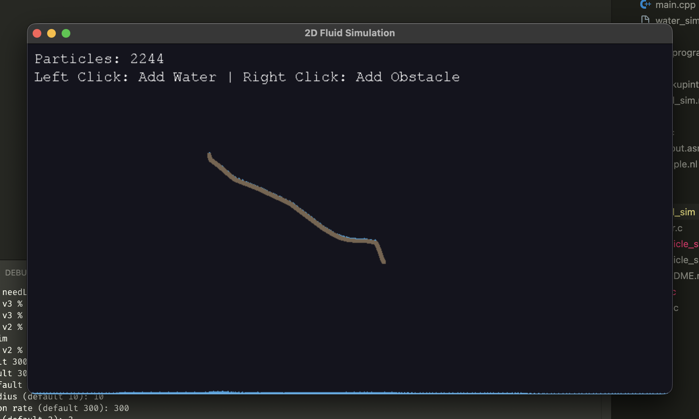

# Vibe coded at a party [Particle Simulation]

A 2D fluid simulation using SDL2 that renders interactive water/sand particles with riylastic physics.

## Features

- **Real-time water simulation** with gravity-based falling
- **Interactive controls**: left click to add water, right click to place obstacles
- **Surface tension** and horizontal spreading for natural flow behavior
- **Optimized rendering** using active cell tracking
- **Configurable parameters** for grid size, gravity steps, and particle generation

## Building

Requires SDL2 and SDL2_ttf:

```bash
gcc -o fluid_sim sdl.c sim.c -lSDL2 -lSDL2_ttf
```

## Running

```bash
./fluid_sim
```

Configure simulation parameters at startup (grid dimensions, gravity steps, particle spawn rate, etc.).

## Controls

- **Left Click**: Add water particles
- **Right Click**: Place/erase obstacles
- **ESC/Close Window**: Exit


